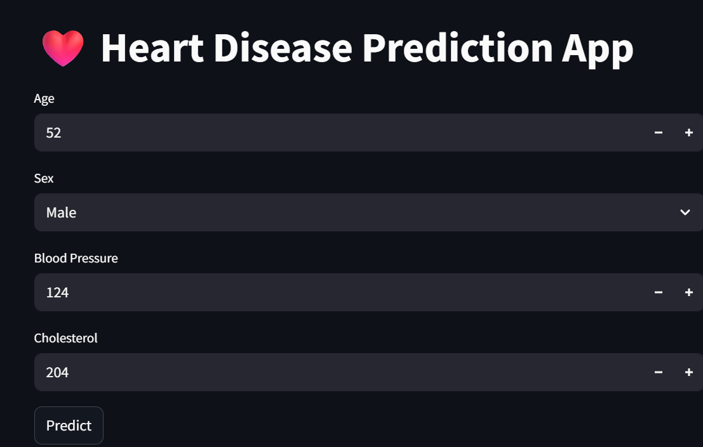
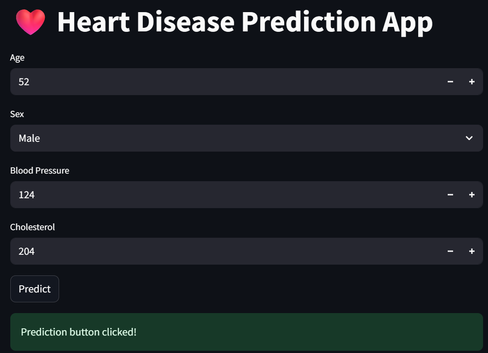

# Project Title
## ❤️ Heart Disease Prediction
# Overview
Machine Learning project that predicts whether a patient is likely to have heart disease based on medical attributes.
# Features
- Data preprocessing
- Exploratory Data Analysis
- Logistic Regression
- Random Forest
- Hyperparameter Tuning
- Streamlit Web App
# Tech Stack
- Python
- Pandas
- Scikit-learn
- Streamlit
- Matplotlib
- Seaborn
# Project Structure
heart-disease-project/
│
├── data/
├── src/
├── model/
├── app.py
├── README.md
# Screenshots
## Application Preview

